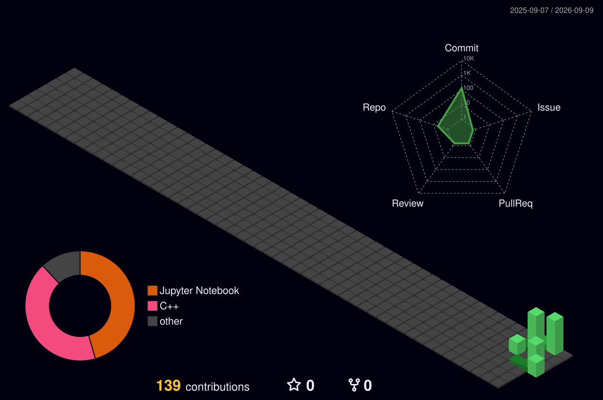

## About Me

Computer Science student at **Korea National Open University (KNOU)** interested in **Machine Learning Systems and AI Infrastructure**, with a focus on **GPU inference, model serving, batching, scheduling, and performance optimization**.

My projects explore the path from model development and native C++ deployment to GPU inference optimization and serving-system research.

---

## Research Interests

- Machine Learning Systems
- GPU Inference & Model Serving
- Batching & Scheduling
- Performance Optimization
- Distributed ML Systems
- Resource Management for AI Workloads

---

## Featured Projects

### Adaptive Batching for GPU Inference Serving
**Research Project · In Progress**

Investigating when adaptive batching provides meaningful benefits over static batching under varying request workloads.

**Research Question**

> Under what workload conditions does adaptive batching outperform static batching in GPU inference serving, and what are the resulting trade-offs between tail latency, throughput, and GPU utilization?

**Highlights**

- Comparing static and queue-aware adaptive batching policies
- Designing controlled experiments across low, medium, high, and bursty workloads
- Measuring throughput, P50/P95/P99 latency, and GPU utilization
- Analyzing throughput–latency trade-offs under different workload conditions

[View Repository →](https://github.com/lucy980509/adaptive-batching-gpu-inference)

---

### GPU Inference Performance Analysis & Optimization

A systematic performance study of GPU inference using **ONNX Runtime and CUDA**, following a baseline → profile → bottleneck → optimize → re-measure workflow.

**Highlights**

- CUDA Execution Provider with ONNX Runtime
- FP32 and FP16 inference analysis
- Batch-size scaling experiments
- GPU profiling with NVIDIA Nsight Systems
- Identification of host-side preprocessing and I/O bottlenecks
- Evaluation of RAM caching and I/O Binding
- Analysis of GPU execution behavior and end-to-end performance

[View Repository →](https://github.com/lucy980509/wafer-defect-inference-cuda)

---

### C++ ONNX Runtime Inference Engine

A native **C++17 inference pipeline** for deploying a trained CNN model without a Python runtime dependency.

**Highlights**

- Native C++17 inference application
- OpenCV preprocessing pipeline
- ONNX Runtime model execution
- End-to-end inference workflow
- Python/C++ numerical consistency validation
- CMake-based build system

[View Repository →](https://github.com/lucy980509/wafer-cpp-inference)

---

### Wafer Defect Classification Using CNN

A deep learning pipeline for semiconductor wafer defect classification using **PyTorch**.

**Highlights**

- WM-811K wafer map dataset
- CNN model development with PyTorch
- Class imbalance handling using weighted loss
- Train / validation / test evaluation
- Confusion matrix and error analysis
- ONNX model export for downstream deployment

[View Repository →](https://github.com/lucy980509/wafer-defect-classification)

---

## 🛠 Technical Skills

### Languages

### Machine Learning & Deployment

### Systems & Performance

---

## Current Research Focus

I am currently exploring efficient GPU inference serving, with particular interest in how **batching, scheduling, workload characteristics, and system bottlenecks** affect:

- Throughput
- Tail latency
- GPU utilization
- Resource efficiency

My long-term goal is to work on **efficient and scalable ML infrastructure**, especially systems for large-scale model inference and serving.

---

## Contact

---

## Contributions

